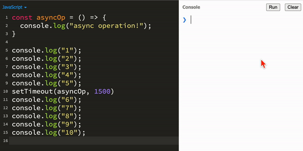
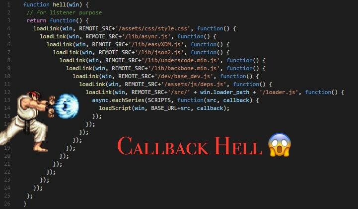

# Intro to Async

### Synchronous Code

All of the code we have written so far has been **synchronous** — the lines of code are executed in the order in which they are written. Each line of code waits for the previous line of code to finish executing.

The code below demonstrates three operations that exectue synchronously followed by the message `'done!'`:

```js
const firstOperation = () => {
    console.log(1)
}
const secondOperation = () => {
    console.log(2)
}
const thirdOperation = () => {
    console.log(3)
}

firstOperation(); // 1
secondOperation(); // 2
thirdOperation(); // 3
console.log('done!'); // prints 'done!'
```

### Asynchronous Code

**Asynchronous (async)** code is **non-blocking**, meaning the code that follows an async operation does not need to wait for it to finish.

Async code needs to be non-blocking because, often, **async operations take time to complete.**

> Imagine trying to load an image from a remote server over a slow internet connection. Rather than holding up the entire program while the image loads, the image can load "in the background" while the rest of the program continues working.



It also means that the order in which operations are executed can vary depending on how long the asynchronous operations take.

Consider the same example, however now the operations are asynchronous and take varying amounts of time. **In what order will the numbers be printed?**

```js
const firstOperation = () => {
    setTimeout(() => {
        console.log(1)
    }, 3000)
}
const secondOperation = () => {
    setTimeout(() => {
        console.log(2)
    }, 1000)
}
const thirdOperation = () => {
    setTimeout(() => {
        console.log(3)
    }, 2000)
}

firstOperation(); // Waits 3 seconds, then prints 1
secondOperation(); // Waits 1 second, then prints 2
thirdOperation(); // Waits 2 seconds, then prints 3
console.log('done!'); // prints 'done!'
```

<details><summary>Answer</summary>

```
'done!'
2
1
3
```

</details>

### Callback Hell

To keep these asynchronous operations in the correct order, we can use callbacks. 

Each operation will be provided the `next` function to execute when the current async operation completes.

```js
const firstOperation = (next) => {
    setTimeout(() => {
        console.log(1);
        next(); // after the operation, invoke the provided next() function
    }, 3000)
}
const secondOperation = (next) => {
    setTimeout(() => {
        console.log(2)
        next(); // after the operation, invoke the provided next() function
    }, 1000)
}
const thirdOperation = (next) => {
    setTimeout(() => {
        console.log(3)
        next(); // after the operation, invoke the provided next() function
    }, 2000)
}

firstOperation(() => {
    secondOperation(() => {
        thirdOperation(() => {
            console.log('done!');
        });
    })
});
```

While we have now fixed the order of operations, we have entered...



Callback hell refers to any code that heavily relies on callbacks to execute code in a sequential manner. The main downsides of callback hell are:
* Difficult to read and debug
* Difficult to add error handling

Promises were introduced to combat callback hell. Promises provide a more easily readable syntax for handling asynchronous code.

### Promises

A `Promise` is a type of object that represents **the eventual completion of an asynchronous operation**, and the associated data produced by that operation. A Promise can exist in one of three states:
1. `pending` - the async operation is not yet complete.
2. `rejected` - the async operation failed and an error is returned.
3. `fulfilled` - the async operation was successful and the desired data is returned!

> 👨🏽‍🍳 When you order from a restaurant, your waiter is making a promise to make your order. While you wait, this promise is still pending. Hopefully, the order is fulfilled and you get your food! Sometimes things go wrong and your order is rejected. Either way, while your order is being prepared, the rest of the restaurant continues operating, whether your order is pending, fulfilled, or rejected! 

A `new Promise()` is constructed with a callback function that:
* contains the asynchronous code to execute
* accepts a `resolve` and `reject` argument. These arguments are both functions. 
    * Invoke `resolve` to change the state of the Promise to `"fulfilled"` and return some data.
    * Invoke `reject` to change the state of the Promise to `"rejected"` and return error data.
    * Until one of these functions is invoked, the Promise remains `"pending"`.

In this example, we create a Promise that, after 3 seconds, we will randomly `resolve()` or `reject()` the Promise, passing along the random value as data

```js
const promise = new Promise((resolve, reject) => {
    
    setTimeout(() => {
        const random = Math.random();
        if (random > 0.5) {
            resolve(random);
        } else {
            reject(random);
        }
    }, 3000);

}); 

console.log(promise);
```

### Then and Catch

Now that we can make a Promise that either is fulfilled or rejected, how do we actually make use of that data?

Promises are "then-able", meaning that they can perform some action _after_ the asynchronous code finishes executing.

> "I promise to do something asynchronous, THEN I will do something when it is done."

```js
const promise = new Promise((resolve, reject) => {
    setTimeout(() => {
        const random = Math.random();
        if (random > 0.5) {
            resolve(random);
        } else {
            reject(random)
        }
    }, 3000);
}); 
promise
    .then(data => console.log(`Promise fulfilled: random was ${data}`)) // executes if `resolve()` was invoked
    .catch(error => console.log(`Promise fulfilled: random was ${error}`)) // executes if `reject()` was invoked
```

If a `Promise` object is fulfilled (the `resolve` callback is invokd), the callback passed to `then` is executed with the resolved data passed in as an argument.

If a `Promise` object is rejected (the `reject` callback is invokd), the callback passed to `catch` is executed with the rejected data passed in as an argument.

### Promisifying Our Code

```js
// Promisifying our functions makes them longer...
// but often we are given already-made promises...
const firstOperation = () => {
    return new Promise((resolve, reject) => { 
        setTimeout(() => {
            console.log(1);
            resolve();
        }, 3000);
    });
}
const secondOperation = () => {
    return new Promise((resolve, reject) => {
        setTimeout(() => {
            console.log(2);
            resolve();
        }, 1000);
    });
}
const thirdOperation = () => {
    return new Promise((resolve, reject) => {
        setTimeout(() => {
            console.log(3);
            resolve();
        }, 2000);
    });
}

// The benefit is that our code to handle the Promise becomes much cleaner!
firstOperation() // returns a Promise
    .then(secondOperation) // invokes the second operation which also returns a promise
    .then(thirdOperation)  // invokes the third operation which also returns a promise
    .then(() => console.log("done"));
```

Each `then` invocation also returns a `Promise` meaning they can be chained together to create highly readable code.


### Challenge

Write a Promise that, each second, will count up to a random number between `1`-`10` starting from `1`. When the chosen number is reached, the Promise will be fulfilled with the chosen number. However, if the count reaches the number `10`, the Promise will be rejected with the number `10`


<details><summary>Solution</summary>

```js
const promise = new Promise((resolve, reject) => {
  let count = 1; // variable to count from 1 to 10
  let chosenNum = Math.ceil(Math.random() * 10); // random number betwen 1-10
  
  let i = setInterval(() => { // optional: save the intervalID so we can stop the interval
    
    console.log(count); // optional: printing the count lets us see the count increment on each tick of the timer
    
    if (count === 10) { // reject case
      reject(count);    // reject the Promise with the count
      clearInterval(i); // optional: stop the interval
    }
    else if (count === chosenNum) { // resolve case
      resolve(count); // resolve the promise with the count
      clearInterval(i); // optional: stop the interval
    }
    else { // If not resolved or rejected, keep counting
      count++;
    }
    
  }, 1000) // 1 second (1000ms) interval
})

promise
  .then(chosenNum => console.log(`The chosen number was ${chosenNum}`)) // executed if the promise is resolved
  .catch(count => console.log(`The count reached 10!`)) // executed if the promise is rejected
```

</details>