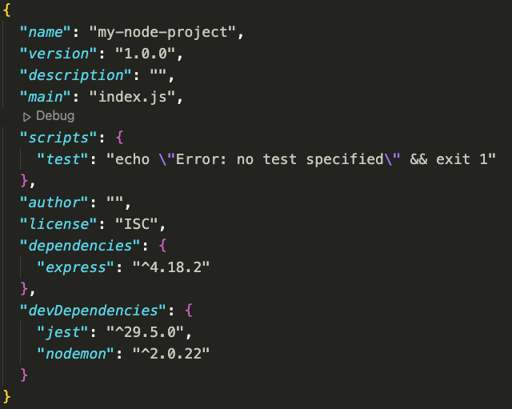

# Intro to Node

**Pre-req / learning**
* https://www.codecademy.com/learn/learn-node-js

**Topics**
* Node
* `package.json`
* npm
* module.exports / require (CommonJS)
* `export` and `import` (ES6)
* Environment variables

## Node

JavaScript has two **runtime environments**
* The browser runtime environment
* The Node runtime environment.

Node is used for:
* Creating server-side code
* Code that is started using the terminal.
* Code that runs without a Browser (no UI).

Suppose we had the following code in an `app.js` file:

```js
// app.js
const rollDie = () => {
    return Math.ceil(Math.random() * 6);
}
```

We can run it in the Node runtime environment with the terminal command `node app.js`

## Starting a Project

Node projects are often much more than just JavaScript files executed in the terminal. They can be just as complex as front-end applications which may utilize mutliple APIs and third-party services.

To create a new Node project, we'll be using `npm` (Node Package Manager). A typical workflow for starting a project looks like this:

1. `npm init` to create a node project and create a `package.json` file
2. Create `app.js` as your "entry point" file
3. Add a `"start"` script to `package.json`: `"start": "node app.js"`
4. Run `npm start`

## Node Package Manager

`npm` is a command-line tool that lets us download **packages** for our Node projects.

A **package** is a collection of files that we can download and import into our projects to add a specific functionality to our program.

Examples of NPM packages:
* https://www.npmjs.com/package/superheroes
* https://www.npmjs.com/package/supervillains
* https://www.npmjs.com/package/nodemon
* https://www.npmjs.com/package/express

#### Installing Packages

* `npm install package-name` is the syntax for installing packages for the current project.

    * Ex: `npm install superheroes`

* `npm i package-name` is the shorthand syntax for installing.
    * Ex: `npm i superheroes`

* `npm i -D package-name` uses the `-D` developer flag which installs packages as a **developer dependency**. Developer dependencies are not used in the program itself, but rather are used to aid in development.
    * Ex: `npm i -D nodemon`
    * Try updating the `"start"` script in `package.json` to use `nodemon` instead of `node`. Make a change to your `.js` file and see it automatically re-run!

### Package.json

Installed packages live in a folder called `node_modules` and are listed in the `package.json` file:



* Note the distinction between `"dependencies"` and `"devDependencies"`.
* Each package is listed with the version being used.
* `package.json` files communicate to other developers which packages a project uses. 
* `node_modules` folders are typically NOT included in git repos. Instead, just the `package.json` file is needed and a developer can run the command `npm install` with no additional arguments and `npm` will look at the `package.json` file and install all dependencies listed there.

## Require

We can import packages installed via `npm` using `require()`. When doing this, we ONLY provide the name of the package and `require()` will assume it is in `node_modules`. 

```js
// app.js
const superheroes = require('superheroes');
const randomHero = superheroes.random();
console.log(randomHero);
```

### module.exports

We can create our own local modules as well!

1. Create a `utils.js` file with functions and variables
2. Export with `module.exports`

```js
// utils.js
const rollDie = () => {
    return Math.ceil(Math.random() * 6);
}
const INSTRUCTOR_NAME = "BEN";
module.exports = {
    rollDie,
    INSTRUCTOR_NAME
}
```

3. In `app.js`, import functions and variables using `require` and the **relative path**:

```js
// app.js
const utilsExports = require("./utils"); // get the whole module.exports object
const { rollDie, INSTRUCTOR_NAME } = require("./utils"); // use destructuring

const roll = rollDie();
console.log(`${INSTRUCTOR_NAME} rolled a ${roll}`);
```

## Environment Variables

Just like the `window` object in a browser, running Node applications have **environment variables**. 

One of the most important is `process.env`.

```js
console.log(process.env)
```

And we can set additional environment variables when we start our program like so:

* `port=8080 host='127.0.0.1' node index.js`

```js
console.log('The value of PORT is:', process.env.PORT); // 8080
```

Often, we won't set these values ourselves in our programs like this. Instead, cloud-hosting services will set these variables on our behalf. As a result, you will often see (and we will write) code that looks like this:

```js
const port = process.env.PORT || 8000;
const host = process.env.HOST || '127.0.0.1'
```

Some other important values available in the Node runtime environment:

* `__dirname` (the full path to the directory holding the current file)
* `process.argv` (arguments included when starting a Node process)
