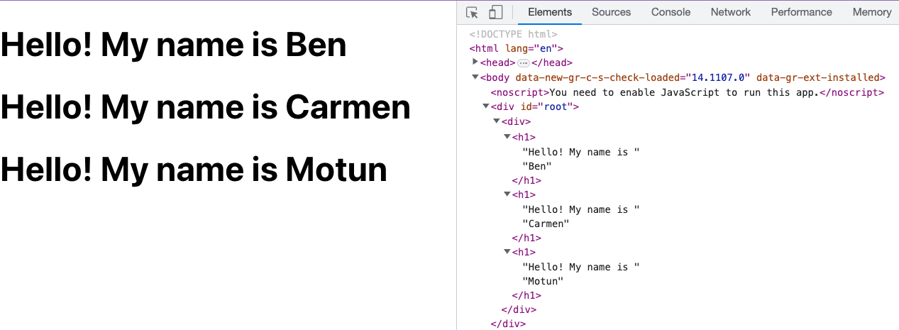

# Intro to React

## Components 

In React, a **component** is a piece of __reusable__ code that represents a part of a user interface. 

Components are used to **render**, **manage**, and **update** the UI elements in your application.

React uses JSX, an HTML-like syntax that can be written in JS files, to create components.

Components in React are functions that return a single JSX element:

```jsx
function Header() {
  return <h1>Hello World</h1>;
}
```
* This `Header` component returns a `<h1>` _JSX element_.
* Component names are capitalized

Components can return as much (or as little) JSX as you want, but they all need to return a single surrounding element. An easy way to achieve this is by using **fragments** (`<> </>`) or just use a `<div>`

```jsx
function Header() {
  return <h1>Hello World</h1>;
}

function InstagramPost() {
  return (
    <div>
      
      <p>Check out my cute cat!</p>
    </div>
  );
}

export default function App() {
  return ( 
    <div>
      <Header />
      <InstagramPost />
    </div>
  )
}
```

* Note how our custom `<Header />` and `<InstagramPost />` components are used within the `App` component. Custom components _must_ be self-closed.
* Here we are also exporting `App` as the `default`. This means that it is the main component of this file.

## Rendering Components

To make our components visible in our UI, we need to **render** them. 

This requires a few steps:
* Import `React` to use JSX in our files
* Import the `StrictMode` component to wrap our entire application.
* Import the `createRoot` function from `react-dom/client` to attach our React application to the `#root` element in the DOM and create a `root` object.
* Import our component(s)
* Call `root.render`, passing along our component.

```jsx
// index.js
import React, { StrictMode } from 'react';
import { createRoot } from 'react-dom/client';
import App from './app.js';

const rootEl = document.getElementById("root");
const root = createRoot(rootEl);

root.render(
  <StrictMode>
    <App />
  </StrictMode>
);
```
* The `StrictMode` component is a tool that highlights potential issues in a program. It works by encapsulating a portion of your full application as a component. `StrictMode` does not render any visible elements in the DOM in development mode, but it enables checks and gives warnings.

Use the `npm start` command to start the React server.

## Injecting JavaScript Values

We can inject JavaScript values into our components using `{}`. 

```jsx
// Notice how we inject this into the <p> inner text
const catName = 'Tom';

function InstagramPost() {
  return (
    <div>
      
      <p>Check out my cute cat named ${catName}!</p>
    </div>
  );
}

// The `style` prop accepts an object like this
const styles = { width: '300px', background: 'red' };

export default function App() {
  return ( 
    <div style={styles}>
      <Header />
      <InstagramPost />
    </div>
  )
}
```

## Props

Every React function-component is passed an argument called `props`. It is an object containing properties provided to the component by the parent.

In this example, the parent component is `App` and it provides a `name` prop to each instance of the `NameHeader` component.

```jsx
function NameHeader(props) {
  const { name } = props;
  return (
    <h1>Hello! My name is {name}</h1>
  )
}

export default function App() {
  return (
    <NameHeader name="Ben" />
    <NameHeader name="Carmen" />
    <NameHeader name="Motun" />
  )
}
```

Which renders...



The `props` parameter will *always* be an object so it is often destructured immediately within the parameter list:

```jsx
function NameHeader({ name }) {
  return (
    <h1>Hello! My name is {name}</h1>
  );
}
```

